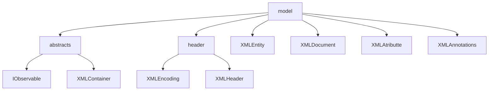
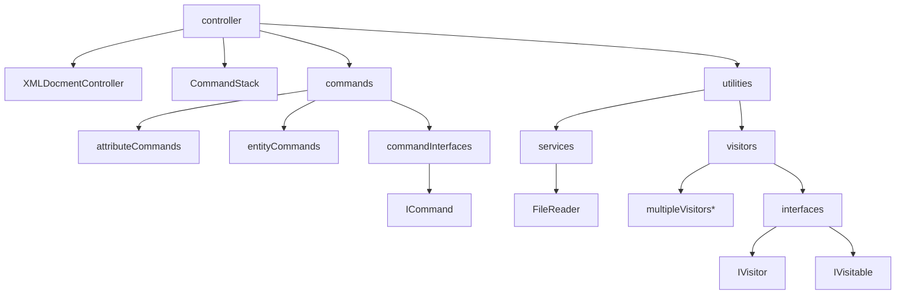
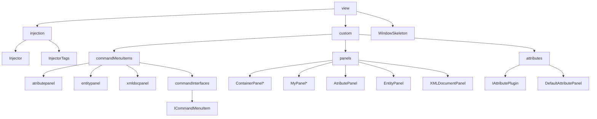
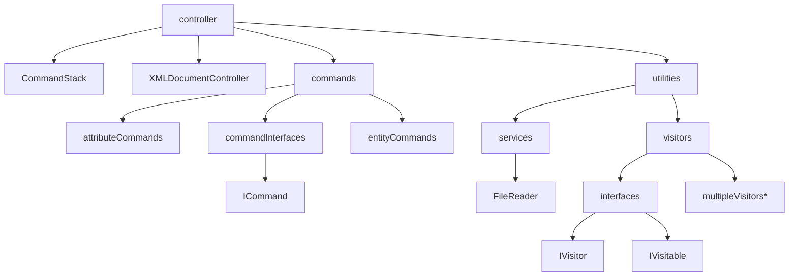
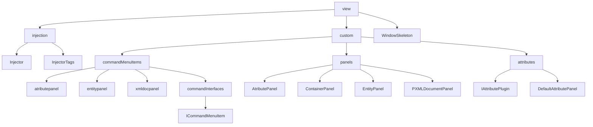
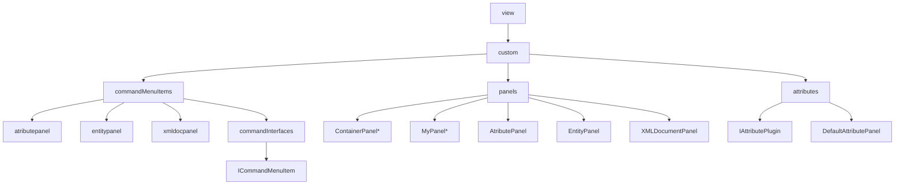
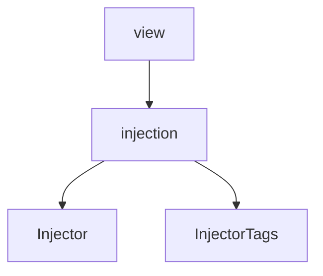

# XML-Generator-API-AdvancedProgramming


### You can view the initial instructions that inspired this project [here](https://andre-santos-pt.github.io/projetoxml/)

### If you are looking to develop a plugin for this framework skip to [Developing plugins](#developing-plugins)

# Wiki

# Project description

Many of you are familiar with **XML**, and it may look something like this:

```xml
<?xml version="1.0"encoding="UTF-8"standalone="no"?>
<Library subTitle="2022" title="Livraria de Lisboa">
    <books>
        <Livro Writer="Jeronimo Stilton" pages="1000">Jeronimo em Belém</Livro>
        <Livro Writer="Fernando Pessoa" pages="200">Fernando no Chiado</Livro>
    </books>
</Library>
```

This project aims to develop an intuitive way to create your own custom xml without the worries that come with specific
syntax.

---

## The project structure

### Main Packages

The project is divided in 2 main packages

| Package    |                                              Description |
|------------|---------------------------------------------------------:|
| Model      |                      The main **problem** representation |
| Controller |                      Ways to **interact** with the model |
| View       | The way to view and **visually** interact with the model |

### In Depth Graph

#### Graph - [Model](#model)



#### Graph - [Controller](#controller)



*multipleVisitors is to represent that multiple classes that implement the IVisitor interface live inside the visitors
package

#### Graph - [View](#view)



*MyPanel and ContainerPanel are abstract classes

Now we will go more in depth on what each package has to offer.

---

### Model

The model uses some clever abstraction to represent an xml document programmatically.

We developed a set of classes that each represent and aspect of xml:


##### XMLHeader

The Header is usually the first line of every xml document, it generally looks something like this:

```xml
<?xml version="1.0" encoding="UTF-8" standalone="no" ?>
```

It has three different properties:

* Version
    * Specifies the version of the XML standard
* Encoding
    * Specifies the encoding of the character set, for example: UTF-8, UTF-16 and
      more [here](https://xmlwriter.net/xml_guide/glossary.shtml#IANA)
* Standalone
    * Specifies if the document has an internal DTD (Document Type Definition), more
      info [here](https://xmlwriter.net/xml_guide/doctype_declaration.shtml#internalDTD)

##### XMLContainer

The XMLContainer is an abstract class that abstracts the concept of a container in XML, basically anything that can have
a parent, a list of children and a depth parameter.

Classes that extend the XMLContainer on the core package:

* XMLDocument
* XMLEntity

###### XMLDocument

Represents the Document, it holds the header and the Root entity

###### XMLEntity

Represents an xml entity.
An **entity** is anything that is wrapped in <>

The entities can bee really **short** like:
`<Chapter/>`

Have **multiple atributes** like:
`<Livro Writer="Jeronimo Stilton" pages="1000">Jeronimo em Belém</Livro>`

Or even other entities **inside**:

```xml

<Livro Writer="Jeronimo Stilton" pages="1000">Jeronimo em Belém
    <chapters>
        <Chapter/>
        <Chapter/>
    </chapters>
</Livro>
```

###### Construction

XMLEntities can be built from a lot of different objects , such as String, Array, Iterable, Map, DataClass and Enum

##### Annotations

Annotations are used to better customize the generated xml

Useful tags include:

* @XmlName
    * Declares the name to be used in xml, overriding the name defined in code.

* @XmlTagContent
    * Declares that the variable is to be converted into xml content and not an xml Tag

* @XmlIgnore
    * Declares that the variable is to be ignored by the xml

### Controller

The controller package is a package respective to controlling the model and serves as a channel for the view to interact
with the model.



*multipleVisitors is to represent that multiple classes that implement the IVisitor interface live inside the visitors
package

##### Commands

A command is an object that represents an action that can be undone.

These objects must implement the ICommand interface, therefore they must override the toString method (for displaying in
the gui), and they must implement an **execute** and an **undo** method.

The purpose of the **undo** method is to revert what was done inside execute.

##### XMLDocumentController

The controller serves as the entry point for interacting with the model.

Whenever you want to change something in the model, you must call the controller and use the `addExecuteCommand` method
to execute your command onto the model and add it onto the commandStack, so you can undo it in the future

The controller has handlers to delegate functionality onto the CommandStack.

##### CommandStack

The command Stack is an object that holds two stacks of Commands.
A list for storing undoCommands and another for redoCommands.

When a command is taken out of the undoStack it is moved onto the redoStack.
Whenever a new command is added to the undoStack, the redoStack is cleaned, this is to prevent clashing operations from
happening.

##### Services

A package where we hold various different specific services.

The only current service is a File Reader that is used for reading the properties file.

##### Visitors

* Visitor Interface
    * Declares two methods, a visit and an endVisit
* Visitable Interface
    * Declares a single method, accept

Visitors are a way to implement custom functionality into our xml "tree".

The Visitable interace is implemented by the abstract class XMLContainer, with the following implementation:

```kotlin
override fun accept(v: IVisitor) {
    if (v.visit(this)) {
        val childrenCopy = mutableListOf<XMLContainer>()
        childrenCopy.addAll(this.children)
        childrenCopy.forEach {
            it.accept(v)
        }
    }
    v.endvisit(this)
}
```

This will go through each child of the container and accept the visitor on every child.

An example of a Visitor can be the SearcherIVisitor.

```kotlin
class SearcherIVisitor(val decidingFunction: (XMLEntity: Visitable) -> Boolean) : IVisitor {

    val entities: MutableList<Visitable> = mutableListOf()

    override fun visit(visitable: Visitable): Boolean {
        if (decidingFunction(visitable)) {
            entities.add(visitable)
        }
        return super.visit(visitable)
    }
}
```

Which takes in a decidingFunction and stores a list of all the visitables that make that function return true.

**TLDR** Visitors can be used to implement custom methods on top of the base architecture.

---

### View



#### Custom



*MyPanel and ContainerPanel are abstract classes

This package comprises Command Menu Items which are wrappers around commands from the controller package that are meant
to be displayed as right click menuOptions.

The panels folder holds the abstract class ContainerPanel which extends MyPanel which in turn extends the java JPanel.

**MyPanel** is an abstraction for creating panels that hold an xmlController and holds the implementation for adding the
popupMenu, as all the implemented panels can have rightClick options.

**ContainerPanel** is an abstraction for XMLContainers (which in the base framework, include XMLEntity and XMLDocument),
it provides ways to add and remove panels that can be displayed in the bod of the parent panels.

The EntityPanel observes a XMLEntity and displays its content, attributes and name in the gui.
It also properly updates when the underlying model changes.

This is true for XMLDocumentPanel and AttributePanel, which observe the XMLDocument and XMLAttribute respectively.

#### Injection



The Injector is the class that actually instantiates and injects outside classes into our own variables that have been
tagged with @Inject or @InjectAdd (declared inside InjectorTags.kt)

---

# Developing plugins

The Plugin side of this framework was developed with freedom always in the forefront.

With the current architecture a plugin must always implement our ICommandMenuItem class.
You can see its implementation
[here](https://github.com/JoaoAlmeida-dev/XML-Generator-API-AdvancedProgramming/blob/master/src/main/kotlin/view/custom/commands/commandInterfaces/ICommandMenuItem.kt)
.

This is because the entry point for our plugins is always through a rightClick menu (a JMenu).

## Relevant Classes for plugin Development

* ICommandMenuItem
* ICommand
* ContainerPanel
* XMLContainer or XMLEntity
* IAttributePlugin

## How do I Inject my things into the framework?

First of all you need to understand **Dependency injection**, which is just a fancy name for saying that you implement
your
own classes and we instanciate and use them inside our framework, injecting them into our structure...
Do you now see where the name comes from?

To do inject your classes you need to change the `di.properties` file.
It has a structure of "class.injectVariable = your_class"

A simple example is one that the framework already uses out of the box, the root xml document used as a base for when
you launch the program:
`WindowSkeleton.rootDocument=testbed.plugins.RootController`
As you can see, the rootDocument variable in the class WindowSkeleton, has an @Inject
tag and our injector will take the RootController class, from testbed.plugins and instanciate it onto that variable

Now if you want to change the base xml object, or have a blank slate you can simply change the right side of the equals
sign to you class or remove the line entirely.

### Inject vs InjectAdd

An InjectAdd, diferently from the simples Inject, can have multiple classes associated to the same variable.
Internally that variable is a list.

To specify this, simply put all the classes you want to inject onto a variable, on the right side of that variable's `=`
sign, separated by commas `,`.
Like so:

`frameworkClass.variableInjectADD=testbed.plugins.myClass1,testbed.plugins.myClass2`

### Available Injections

A list of all the **Inject** variables available currently

* `WindowSkeleton.rootDocument`

A list of all the **InjectAdd** variables available currently

* `XMLDocumentController.entityPluginCommands`
* `XMLDocumentController.attributePluginCommands`
* `XMLDocumentController.xmldocumentPluginCommands`

## How do I specify my plugin?

### GUI extensions

So if your goal is to make a new Menu Option that creates a new Panel on the **GUI** of the app, then all you have to do
is
implement a new **ICommandMenuItem**.

The following example should sufice:

```kotlin
class CustomPanelCommandMenuItem : ICommandMenuItem<EntityPanel> {
    override fun accept(panel: EntityPanel): Boolean = true

    override fun getJMenuItem(panel: EntityPanel): JMenuItem {
        val myCustomPanel = JPanel()
        val webPage = JEditorPane()
        webPage.isEditable = false
        webPage.setPage("https://google.com/")

        myCustomPanel.add(JScrollPane(webPage))
        val jMenuItem = JMenuItem("Add my custom Panel")
        jMenuItem.addActionListener {
            panel.xmlController.addExecuteCommand(AddPanelCommand(panel, myCustomPanel))
        }
        return jMenuItem
    }
}
```

As you can see, anything can be done with few lines of code.

The accept method is to determine whether the menuItem should be enabled or disabled for said panel.

The getJMenuItem method returns the JMenuItem that you can see in the above picture.
Then, when the user clicks on it, we will go the xmlController stored inside the clickedPanel and add and Execute a
command.
This particular AddPanelCommand simply adds the JPanel onto the body of the parent Panel, **not** changing the
underlying xml model.


### What if I want to change the model and add my custom xml snippet to it?

For that we dont need to change much, simply changing the command that is going to be inserted onto our stack will
suffice:
For the example lets implement a simple class that stores a snipet of code:

```kotlin

data class MySnippet(
    val name: String = "for Loop",
    val code: String = " for (int i = 0; i<Infinity; i++)"
) {}

```

Then we need to implement the ICommandMenuItem in another class:

```kotlin
class CustomXMLSnippetCommandMenuItem : ICommandMenuItem<EntityPanel> {
    override fun accept(panel: EntityPanel): Boolean = true

    override fun getJMenuItem(panel: EntityPanel): JMenuItem {
        val jMenuItem = JMenuItem("Add my xml Snippet")
        jMenuItem.addActionListener {
            panel.xmlController.addExecuteCommand(
                AddChildCommand(
                    panel.xmlEntity,
                    XMLEntity(MySnippet(), parent = panel.xmlEntity)
                )
            )
        }
        return jMenuItem
    }
}
```

Now we used the **AddChildCommand** in order to take the xmlEntity of the parent panel and add our new entity to it,
changing the underlying model.

Notice that we wrapped our MySnippet inside a XMLEntity, and gave it the entity of the panel we clicked on as a parent,
this is so it is correctly placed inside our model, and because our model works with this XMLEntity class, details on it
can e found [here](#xmlentity)


The xml after the change:

```xml
<?xml version="1.0" encoding="UTF-8" standalone="no" ?>
<Library subTitle="2022" title="Livraria de Lisboa">
    <books>
        <Livro Writer="Jeronimo Stilton" pages="1000" store="BERTRAND">Jeronimo em Belém
            <chapters>
                <Chapter name="Chapter 1" pageN="20"/>
                <Chapter name="Chapter 2" pageN="40"/>
                <MySnippet code=" for (int i = 0; i<Infinity; i++)" name="for Loop"/>
            </chapters>
        </Livro>
    </books>
</Library> 
```

### What if I want to change how the xml model is displayed on the GUI?

To change the default display of attributes in the gui, you need to implement your version of the IAttributePlugin
interface.

The following example shows how to display attributes where the key is either equals to "title" or to "name".
And makes them a JLabel instead of a JTextField.

```kotlin

class AttributeTitlePlugin : IAtributePlugin {
    override fun accept(attribute: XMLAttribute): Boolean {
        return attribute.key.lowercase(Locale.getDefault()) == "title" || attribute.key.lowercase(Locale.getDefault()) == "name"
    }

    override fun getPanel(
        parentXMLEntity: XMLEntity,
        attribute: XMLAttribute,
        xmlDocumentController: XMLDocumentController
    ): AttributePanel {
        println("Boolean atribute sucess")
        return InnerTitleAttributePanel(parentXMLEntity, attribute, xmlDocumentController)
    }

    private class InnerTitleAttributePanel(
        parentXMLEntity: XMLEntity,
        xmlAttribute: XMLAttribute, xmlController: XMLDocumentController
    ) : AttributePanel(parentXMLEntity, xmlAttribute, xmlController) {
        init {
            layout = GridLayout(1, 2)
        }

        override fun constructView(attribute: XMLAttribute) {
            add(JLabel(xmlAttribute.key, SwingConstants.RIGHT))
            add(JLabel(xmlAttribute.value.toString(), SwingConstants.CENTER))
        }
    }
}
```

The accept function determines when this AttributePlugin will be used.

The getPanel method returns the AttributePanel that will be displayed, here you can implement your own version of the
panel.
To do that we extended the base AttributePanel and overriden the constructView to add all the labels and components we
need onto the panel. Our framework will take care of updating itself, clearing all its components and executing this
constructView method every time the attribute also changes.

You can see the results of this implementation in the following image:

As you can see, now all the attributes with key = "name" or "title" are now JLabels.

### Using it all together

Here we used two plugins to create the following experience:


* Note: we changed the background of the relevant attributes for this example, for easier viewing.

We added a new MenuOption to add an Event, it takes a date, a description and a boolean checkBox to know if it is
mandatory or not.

```kotlin
data class Event(
    val date: Date,
    val description: String,
    val isMandatory: Boolean
) : XMLContainer()
```

We then need to implement the MenuOption:

```kotlin
class EventCommandMenuItem : ICommandMenuItem<EntityPanel> {

    override fun accept(panel: EntityPanel): Boolean {
        return true
    }

    override fun getJMenuItem(panel: EntityPanel): JMenuItem {
        val addChildMenuItem = JMenuItem("Add Event")
        addChildMenuItem.addActionListener {
            val jSpinner = JSpinner(SpinnerDateModel(Date(), null, null, Calendar.DATE))
            val descriptionTextBox = JTextField()
            val isMandatoryCheckBox = JCheckBox()
            val jPanel = JPanel()
            jPanel.layout = GridLayout(0, 2)
            jPanel.add(JLabel("date"))
            jPanel.add(jSpinner)
            jPanel.add(JLabel("description"))
            jPanel.add(descriptionTextBox)
            jPanel.add(JLabel("isMandatory"))
            jPanel.add(isMandatoryCheckBox)

            val result: Int = JOptionPane.showConfirmDialog(
                null,
                jPanel,
                "Insert the Event's name",
                JOptionPane.OK_CANCEL_OPTION
            )
            if (result == JOptionPane.OK_OPTION) {
                val date: Date = jSpinner.value as Date
                println(date)
                val event = Event(date, descriptionTextBox.text, isMandatoryCheckBox.isSelected)
                panel.xmlController.addExecuteCommand(
                    AddChildCommand(
                        panel.xmlEntity,
                        XMLEntity(event, parent = panel.xmlEntity)
                    )
                )
            }
        }
        return addChildMenuItem
    }
}
```

This menuOption adds the event gotten from user input and adds it to the model, wrapped inside an XMLEntity.

To put the cherry on top of the cake, We develop two different AttributePlugins:

#### AttributeBooleanPlugin

```kotlin
class AttributeBooleanPlugin : IAtributePlugin {
    override fun accept(attribute: XMLAttribute): Boolean {
        return attribute.value::class == Boolean::class
    }

    override fun getPanel(
        parentXMLEntity: XMLEntity,
        attribute: XMLAttribute,
        xmlDocumentController: XMLDocumentController
    ): AttributePanel {
        println("Boolean atribute sucess")
        return InnerBooleanAttributePanel(parentXMLEntity, attribute, xmlDocumentController)
    }

    private class InnerBooleanAttributePanel(
        parentXMLEntity: XMLEntity,
        xmlAttribute: XMLAttribute, xmlController: XMLDocumentController
    ) : AttributePanel(parentXMLEntity, xmlAttribute, xmlController) {
        init {
            layout = GridLayout(1, 2)
            background = Color.GREEN
        }

        override fun constructView(attribute: XMLAttribute) {
            add(JLabel(xmlAttribute.key, SwingConstants.RIGHT))
            val valueCheckBox = JCheckBox()
            valueCheckBox.isSelected = attribute.value as Boolean
            valueCheckBox.addActionListener {
                xmlController.addExecuteCommand(SetAtributeCommand(xmlAttribute, valueCheckBox.isSelected))
            }
            add(valueCheckBox)
        }


    }
}
```

Where we target all the Attributes with value as a boolean (in the accept method) and display a JCheckBox.

#### AttributeHourPlugin

```kotlin
class AttributeHourPlugin : IAtributePlugin {
    override fun accept(attribute: XMLAttribute): Boolean {
        return attribute.value::class == Date::class
    }

    override fun getPanel(
        parentXMLEntity: XMLEntity,
        attribute: XMLAttribute,
        xmlDocumentController: XMLDocumentController
    ): AttributePanel {
        println("Hour atribute sucess")
        return InnerHourAttributePanel(parentXMLEntity, attribute, xmlDocumentController)
    }

    private class InnerHourAttributePanel(
        parentXMLEntity: XMLEntity,
        xmlAttribute: XMLAttribute, xmlController: XMLDocumentController
    ) : AttributePanel(parentXMLEntity, xmlAttribute, xmlController) {
        init {
            layout = GridLayout(2, 1)
            background = Color.GREEN
        }

        override fun constructView(attribute: XMLAttribute) {
            val value = attribute.value
            if (value::class == Date::class) {
                value as Date
                add(JLabel(xmlAttribute.key, SwingConstants.RIGHT))
                val valueTextField =
                    JSpinner(SpinnerDateModel(value, null, null, Calendar.DATE))
                valueTextField.addChangeListener { e: ChangeEvent? ->
                    if (e != null) {
                        xmlController.addExecuteCommand(
                            SetAtributeCommand(xmlAttribute, valueTextField.value)
                        )
                    }
                }
                add(valueTextField)
            }
        }
    }
}
```

Where we target all the Attributes with value as a Date (in the accept method) and display a JSpinner.
We also changed the layout of the panel to show that layout changes are possible.

## Final Plugin Development Tips

With all of this freedom comes responsibility...🕷

As a plugin Developer you must not forget to call the xmlController.addExecuteCommand method and pass in a command if
you want to see your changes applied to the model.

You are also responsible for adding action listeners to your custom TextFields and custom panels to properly display
change in the model and in the GUI

# Thank you

That is all for now.
Open an issue if you have any doubts, we will try our best to help you in your dev journey.

João-Almeida-dev