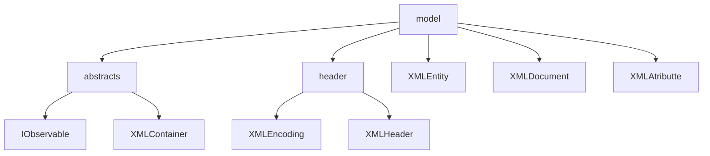
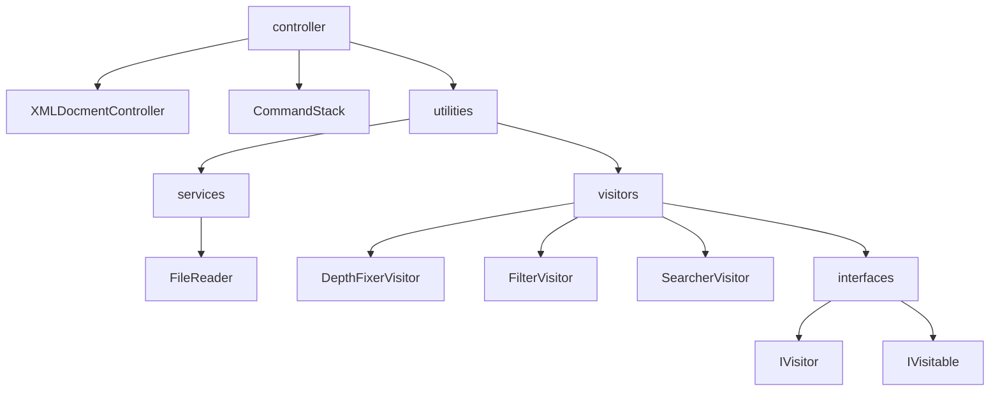
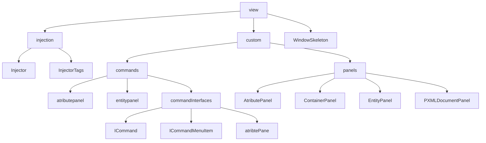
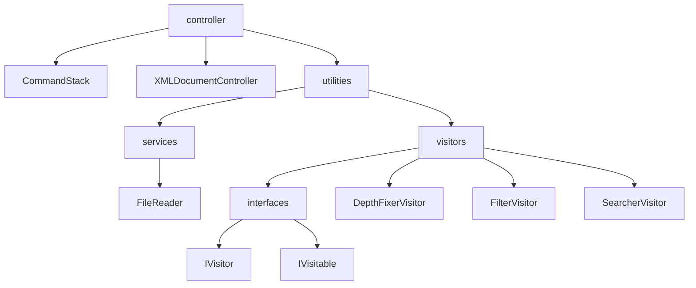
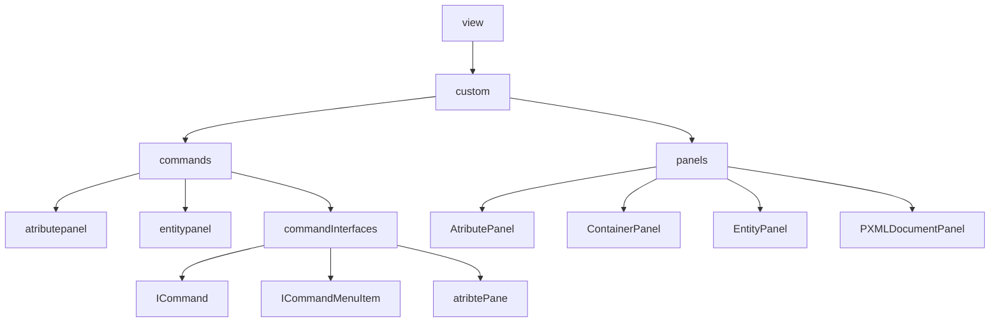
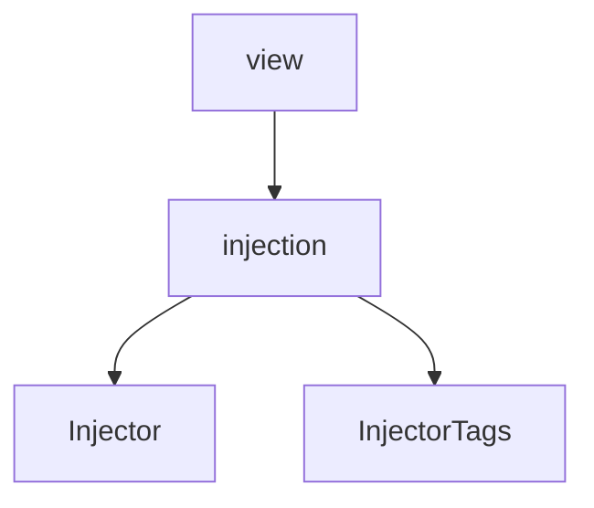

# XML-Generator-API-AdvancedProgramming


### You can view the initial instructions that inspired this project [here](https://andre-santos-pt.github.io/projetoxml/)

### If you are looking to develop a plugin for this framework skip to [Developing plugins](#developing-plugins)

# Wiki

# Project description

Many of you are familiar with **XML**, and it may look something like this:

```xml
<?xml version="1.0"encoding="UTF-8"standalone="no"?>
<Library subTitle="2022" title="Livraria de Lisboa">
    <books>
        <Livro Writer="Jeronimo Stilton" pages="1000">Jeronimo em Belém</Livro>
        <Livro Writer="Fernando Pessoa" pages="200">Fernando no Chiado</Livro>
    </books>
</Library>
```

This project aims to develop an intuitive way to create your own custom xml without the worries that come with specific
syntax.

---

## The project structure

### Main Packages

The project is divided in 2 main packages

| Package    |                                              Description |
|------------|---------------------------------------------------------:|
| Model      |                      The main **problem** representation |
| Controller |                      Ways to **interact** with the model |
| View       | The way to view and **visually** interact with the model |

### In Depth Graph

#### Graph - [Model](#model)



#### Graph - [Controller](#controller)



#### Graph - [View](#view)



Now we will go more in depth on what each package has to offer.

---

### Model

The model uses some clever abstraction to represent an xml document programmatically.

We developed a set of classes that each represent and aspect of xml:


##### XMLHeader

The Header is usually the first line of every xml document, it generally looks something like this:

```xml
<?xml version="1.0" encoding="UTF-8" standalone="no" ?>
```

It has three diferent properties:

* Version
    * Specifies the version of the XML standard
* Encoding
    * Specifies the encoding of the character set, for example: UTF-8, UTF-16 and
      more [here](https://xmlwriter.net/xml_guide/glossary.shtml#IANA)
* Standalone
    * Specifies if the document has an internal DTD (Document Type Definition), more
      info [here](https://xmlwriter.net/xml_guide/doctype_declaration.shtml#internalDTD)

##### XMLContainer

The XMLContainer is an abstract class that abstracts the concept of a container in XML, basically anything that can have
a parent, a list of children and a depth parameter.

Classes that extend the XMLContainer on the core package:

* XMLDocument
* XMLEntity

###### XMLDocument

Represents the Document, it holds the header and the Root entity

###### XMLEntity

Represents an xml entity.
An **entity** is anything that is wrapped in <>

The entities can bee really **short** like:
`<Chapter/>`

Have **multiple atributes** like:
`<Livro Writer="Jeronimo Stilton" pages="1000">Jeronimo em Belém</Livro>`

Or even other entities **inside**:

```xml

<Livro Writer="Jeronimo Stilton" pages="1000">Jeronimo em Belém
    <chapters>
        <Chapter/>
        <Chapter/>
    </chapters>
</Livro>
```

##### Annotations

Annotations are used to better customize the generated xml

Useful tags include:

* @XmlName
    * Declares the name to be used in xml, overriding the name defined in code.

* @XmlTagContent
    * Declares that the variable is to be converted into xml content and not an xml Tag

* @XmlIgnore
    * Declares that the variable is to be ignored by the xml

### Controller

The controller package is a package respective to controlling the model and serves as a channel for the view to interact
with the model.



##### Services

A package where we hold various diferent specific services.

The only current service is a File Reader that is used for reading the properties file.

##### Visitors

* Visitor Interface
    * Declares two methods, a visit and an endVisit
* Visitable Interface
    * Declares a single method, accept

Visitors are a way to implement custom functionality into our xml "tree".

The Visitable interace is implemented by the abstract class XMLContainer, with the following implementation:

```kotlin
override fun accept(v: IVisitor) {
    if (v.visit(this)) {
        val childrenCopy = mutableListOf<XMLContainer>()
        childrenCopy.addAll(this.children)
        childrenCopy.forEach {
            it.accept(v)
        }
    }
    v.endvisit(this)
}
```

This will go through each child of the container and accept the visitor on every child.

An example of a Visitor can be the SearcherIVisitor.

```kotlin
class SearcherIVisitor(val decidingFunction: (XMLEntity: Visitable) -> Boolean) : IVisitor {

    val entities: MutableList<Visitable> = mutableListOf()

    override fun visit(visitable: Visitable): Boolean {
        if (decidingFunction(visitable)) {
            entities.add(visitable)
        }
        return super.visit(visitable)
    }
}
```

Which takes in a decidingFunction and stores a list of all the visitables that make that function return true.

**TLDR** Visitors can be used to implement custom methods on top of the base architecture.

---

### View


#### Custom



#### Injection



---

# Developing plugins

The Plugin side of this framework was developed with freedom always in the forefront.

With the current architecture a plugin must always implement our ICommandMenuItem class.
You can see its implementation
[here](https://github.com/JoaoAlmeida-dev/XML-Generator-API-AdvancedProgramming/blob/master/src/main/kotlin/view/custom/commands/commandInterfaces/ICommandMenuItem.kt)
.

This is because the entry point for our plugins is always trough a rightClick menu (a Jmenu).

## Classes you should implement/extend

* ICommandMenuItem
* ICommand
* ContainerPanel
* XMLContainer or XMLEntity
