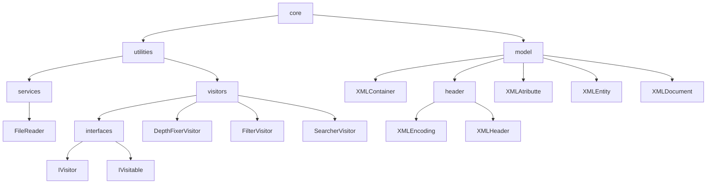
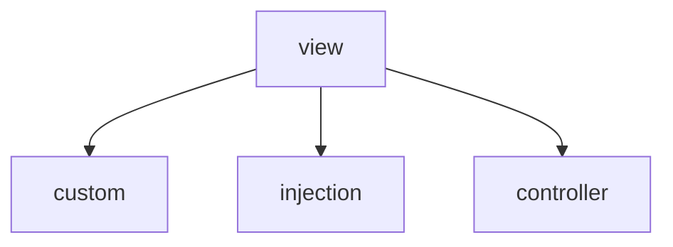

# XMLin

# Wiki

### You can view the initial instructions that inspired this project [here](https://andre-santos-pt.github.io/projetoxml/)

# Project description

Many of you are familiar with **XML**, and it may look something like this:

```xml
<?xml version="1.0"encoding="UTF-8"standalone="no"?>
<Library subTitle="2022" title="Livraria de Lisboa">
    <books>
        <Livro Writer="Jeronimo Stilton" pages="1000">Jeronimo em Belém</Livro>
        <Livro Writer="Fernando Pessoa" pages="200">Fernando no Chiado</Livro>
    </books>
</Library>
```

This project aims to develop an intuitive way to create your own custom xml without the worries that come with specific
syntax.

---

## The project structure

The project is divided in 2 main packages

| Package    |                                                          Description |
|------------|---------------------------------------------------------------------:|
| Core       | The main **problem** representation and ways to **interact** with it |
| View       |             The way to view and **visually** interact with the model |

### In Depth Graph

#### Core


#### View



Now we will go more in depth on what each package has to offer

---

### Core

Inside the core we have the Model and the Utilities sub packages

#### Model

The model uses some clever abstraction to represent an xml document programmatically.

We developed a set of classes that each represent and aspect of xml:

* XmlHeader
* XMLContainer (abstract)
    * XMLDocument
    * XMLEntity
    * XMLAtribute
* XMLAnnotations

##### XmlHeader

The Header is usually the first line of every xml document, it generally looks something like this:

```xml
<?xml version="1.0" encoding="UTF-8" standalone="no" ?>
```

It has three diferent properties:

* Version
    * Specifies the version of the XML standart
* Encoding
    * Specifies the encoding of the character set, for example: UTF-8, UTF-16 and
      more [here](https://xmlwriter.net/xml_guide/glossary.shtml#IANA)
* Standalone
    * Specifies if the document has an internal DTD (Document Type Definition), more
      info [here](https://xmlwriter.net/xml_guide/doctype_declaration.shtml#internalDTD)

##### XMLContainer

The XMLContainer is an abstract class that abstracts the concept of a container in XML, basically anything that can have
a parent, a list of children and a depth parameter.

Classes that extend the XMLContainer on the core package:

* XMLDocument
* XMLEntity

###### XMLDocument

Represents the Document, it holds the header and the Root entity

###### XMLEntity

Represents an xml entity.
An **entity** is anything that is wrapped in <>

The entities can bee really **short** like:
`<Chapter/>`

Have **multiple atributes** like:
`<Livro Writer="Jeronimo Stilton" pages="1000">Jeronimo em Belém</Livro>`

Or even other entities **inside**:

```xml

<Livro Writer="Jeronimo Stilton" pages="1000">Jeronimo em Belém
    <chapters>
        <Chapter/>
        <Chapter/>
    </chapters>
</Livro>
```

##### Annotations

#### Utilities

---

### View

---

# Developing plugins

## Classes you should implement/extend

*
*
*
*
